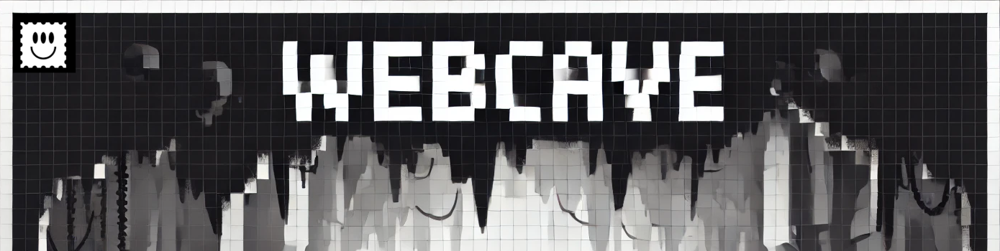

Light & Pluggable clone of the Cave Game written in TypeScript

## Structure ◕_◕
This repository is a monorepo containing packages needed to run
WebCave in your project or simply spinning up your own client
and server

### Projects

**webcave-core**  
Contains all the core game business logic

---
**webcave-client**    
Client implementation for any JS/TS frontend

---
**webcave-server**    
Server implementation for hosting a multiplayer game

---
**webcave-react**  
React wrapper for **webcave-client** package

---
**webcave-example-frontend**  
Example React/Vite/Typescript project showcasing how to run the
game

---

## Running the project ⊂(◉‿◉)つ
### Requirements (︶︹︶)
To run the project, you'll need:
- If setting up using **[Docker](https://www.docker.com)**:
  - Installed Docker
  - Installed docker-compose (Bundled with the official Docker setup)
- If setting up locally
  - [Node.js](https://nodejs.org/en/) (Version 18)
  - [Yarn](https://yarnpkg.com/)

### Installation ███▒▒▒▒▒▒▒
#### Git
1. Clone the repo: ```git clone https://github.com/acid-info/WebCave.git```
2. Navigate to the folder: ```cd WebCave```

#### Installing the dependencies
3. Run ```yarn``` to install the dependencies

### Commands (Development) ¯\(°_o)/¯
| Name                 | Command               | Description                                                                             |
|----------------------|-----------------------|-----------------------------------------------------------------------------------------|
| Build                | ```yarn build```      | Builds all the packages inside the project                                              |
| Linting              | ```yarn lint```       | Lints the project using `pretty-quick`                                                  |
| Running Singleplayer | ```yarn dev```        | Runs the project (only client) in development mode                                      |
| Running Multiplayer  | ```yarn dev:mp```     | Runs the client and server in development mode allowing for Multiplayer in unified flow |
| Run the Client       | ```yarn dev:client``` | Runs the example frontend in dev mode                                                   |
| Run the Server       | ```yarn dev:server``` | Runs the game server in dev mode                                                        |


### Running the game server ─=≡Σ((( つ◕ل͜◕)つ
To run the server, follow next steps:

**Step 1:** Navigate to the server package  
```cd packages/webcave-server```

**Step 2:** Create the .env file and fill/change any missing data  
```cp .env.example .env```

**Step 3:** Run docker  
```docker-compose up```

**Step 4:** Enjoy! ٩(^‿^)۶

<br/>


### Made with ❤
by [acid.info](https://acid.info/)